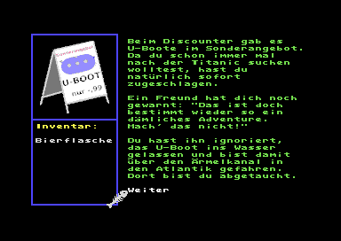

# Tiefsee: Ein Adventure mit Raster-Trick-Bildern für den C64

Um die [Raster-Trick-Bilder](https://github.com/kumakyoo64/RTI) mal in
der Praxis auszuprobieren, habe ich damit ein kleines Adventure
geschrieben: Du bist mit einem Einweg-U-Boot zur Titanic abgetaucht.
Schaffst du es, wieder hoch zu kommen, bevor der Sauerstoff zu Ende
ist?

## Systemvoraussetzungen:

Floppy mit Gerätenummer 8, Joystick an Port II, PAL-VIC

## Installation

Die Datei `tiefsee.d64` enthält ein fertiges Disketten-Image.

Mit `php make.php` kann man sich dieses auch aus den Quellen
herstellen lassen. Die Bilder werden dabei nur dann neu erstellt, wenn
man die entsprechenden `.a`-Dateien im Verzeichnis `Bilder` zuvor
löscht. Es kann sein, dass die Qualität der Bilder beim Neuerstellen
etwas geringer ausfällt, da das Java-Programm `RTI.java` für die
Originale zum Teil mit optimierten Parametern aufgerufen wurde.

Für das Kompilieren benötigt man PHP, Java, ACME und vom VICE die
beiden Tools petcat und c1541. Entwickelt und getestet wurde alles
unter Linux. Mit anderen Betriebssystemen sind möglicherweise kleine
Anpassungen notwendig.

## Anleitung

Gesteuert wird mit dem Joystick in Port II. Man kann unter
vorgegebenen Aktionen auswählen oder einen Gegenstand benutzen. An
einigen Stellen steht nur die Auswahl "Weiter" zur Verfügung. In
diesem Fall kann man den Cursor nicht bewegen, sondern nur durch
Drücken auf den Feuerknopf das Spiel fortsetzen.

## Veröffentlichungen

Das Spiel wurde im [Forum64](https://www.forum64.de/) und in der
[Digital Talk](https://digitaltalk.at/) veröffentlicht.

## Details

Das Spiel wurde in einer extra dafür erfundenen Sprache entwickelt
(`tiefsee.u`), welche mit `converter.php` in BASIC übersetzt wird. Da
das Programm in dieser Form für den Speicher des C64 zu lang ist,
wurde ein weiteres Programm `shorten.php` entwickelt, welches
BASIC-Programme kürzt.
